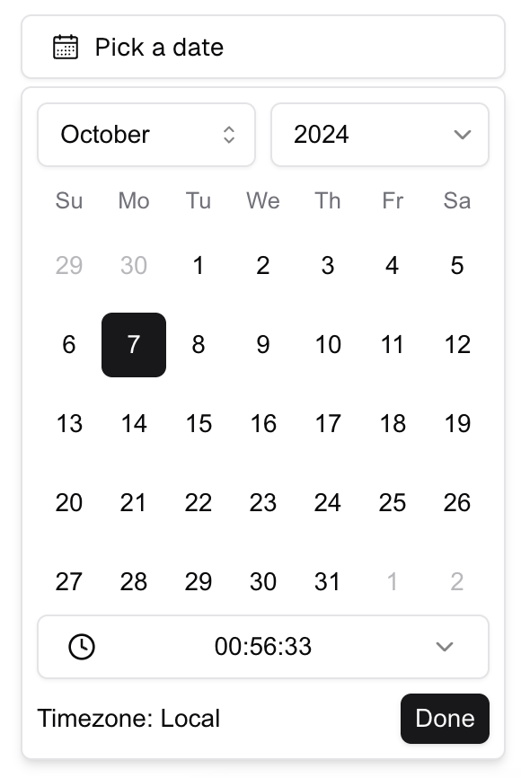

# Shadcn Datetime Picker

Shadcn Datetime Picker is a fully-featured, customizable component for selecting dates and times, built specifically for the Shadcn UI ecosystem. Designed for seamless integration with React applications, this picker offers advanced functionality such as timezone support, month/year selection, and minimum/maximum date restrictions.

**Key Features**:
- **Datetime Picker**: Select both date and time in a single intuitive component.
- **Date Picker**: A standalone date selector for quick date inputs.
- **Time Picker**: Easily choose times with a simple interface.
- **Timezone Support**: Display and handle dates across different timezones.
- **Month/Year Selection**: Choose months and years directly for easier navigation.
- **Min/Max Date**: Restrict selectable dates within a defined range.

This component is designed to be lightweight, responsive, and highly customizable, making it a must-have for any project using Shadcn UI. Improve the user experience of your React apps with a reliable and flexible datetime picker solution.

Demo: https://shadcn-datetime-picker-pro.vercel.app/



### Demo DateTime Picker Input

https://shadcn-datetime-picker-pro.vercel.app/?path=/story/datetimepicker--date-time-input-picker-in-form

<video width="500px" controls>
  <source src="https://github.com/user-attachments/assets/8634d7b4-e28e-43a1-be18-51c08f5ddcf2" type="video/mp4">
  Your browser does not support the video tag.
</video>

### Installation

To install the Shadcn Datetime Picker, follow these steps:

1. **Install Shadcn dependencies**
   ```bash
   npx shadcn@latest add button dropdown-menu input label popover select scroll-area
   ```

2. **Install react-day-picker**
   ```bash
   yarn add react-day-picker@^9
   ```

3. **Copy and paste** below codes into your project.
- [datetime-picker.tsx](./components/datetime-picker.tsx)
- [datetime-input.tsx](./components/datetime-input.tsx)
- [simple-time-picker.tsx](./components/simple-time-picker.tsx)

### Usage

#### 1. Simple DateTime Picker
```tsx
import { DateTimePicker } from '@/components/datetime-picker';

export default function Home() {
  const [date, setDate] = useState<Date | undefined>(undefined);
  return <DateTimePicker value={date} onChange={setDate} />;
}
```

#### 2. DateTime Picker with Timezone
```tsx
import { DateTimePicker } from '@/components/datetime-picker';

export default function Home() {
  const [date, setDate] = useState<Date | undefined>(undefined);
  return <DateTimePicker value={date} onChange={setDate} timezone="UTC" />;
}
```

#### 3. Custom Trigger for DateTime Picker
```tsx
import { DateTimePicker } from '@/components/datetime-picker';

export default function Home() {
  const [date, setDate] = useState<Date | undefined>(undefined);
  return (
    <DateTimePicker
      value={date}
      onChange={setDate}
      renderTrigger={(value, timezone) => <Button>{value?.toLocaleString()}</Button>}
    />
  );
}
```

#### 4. With min and max date
```tsx
import { DateTimePicker } from '@/components/datetime-picker';

export default function Home() {
  const [date, setDate] = useState<Date | undefined>(undefined);
  const minDate = useMemo(() => subHours(new Date(), 2), []);
  const maxDate = useMemo(() => addMonths(new Date(), 2), []);
  return <DateTimePicker value={date} onChange={setDate} min={minDate} max={maxDate} />;
}
```

### Contributing

We welcome contributions! Please feel free to submit a pull request or open an issue for any suggestions or improvements.
