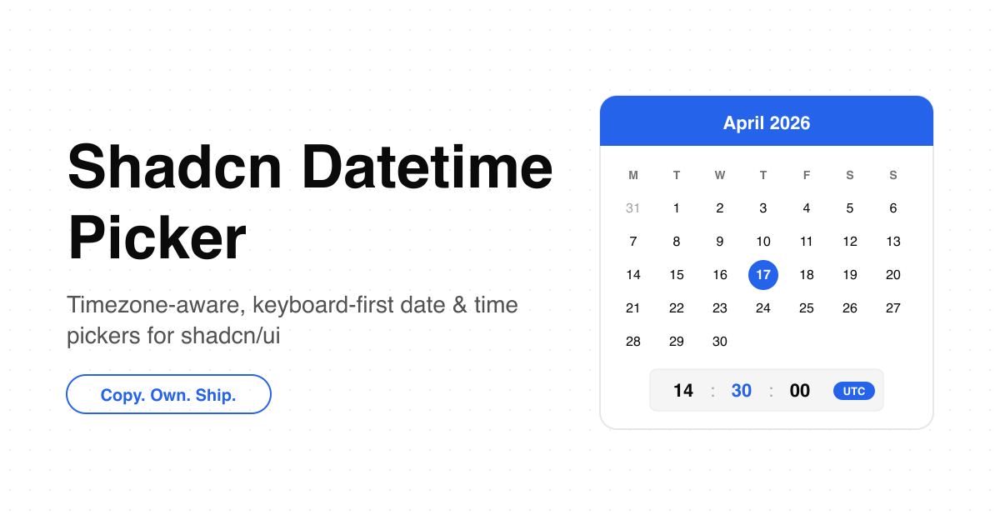

# Shadcn Datetime Picker

> The most flexible date and time picker for shadcn/ui — installed in one command, fully owned by your project.



[](https://shadcn-datetime-picker-pro.vercel.app/)
[](https://github.com/huybuidac/shadcn-datetime-picker)
[](https://github.com/huybuidac/shadcn-datetime-picker)
[](./LICENSE)
[](https://github.com/huybuidac/shadcn-datetime-picker/pulls)

Drop-in date, time, and date-time pickers built the shadcn way — copy the source, own the styles, ship faster. No black-box dependency, just three self-contained files you can read, fork, and bend to your design system.

**[→ Open the live demo](https://shadcn-datetime-picker-pro.vercel.app/)** · **[→ View Storybook stories](https://shadcn-datetime-picker-pro.vercel.app/?path=/story/datetimepicker--date-time-input-picker-in-form)**

---

## Quick Start

```bash
# Add the full datetime picker (calendar + time + timezone) — one command, owns the source.
npx shadcn@latest add https://shadcn-datetime-picker-pro.vercel.app/r/datetime-picker.json
```

That's it. The shadcn CLI installs `button`, `popover`, `scroll-area`, plus `date-fns`, `react-day-picker@^9`, `lucide-react`, and drops the picker into `components/datetime-picker.tsx` per your `components.json` aliases.

[→ See all install options](#install)

---

## Why this picker?

Three things this repo does that other shadcn datetime pickers don't:

1. **Real timezone support, not just UTC offset.** Powered by `react-day-picker` v9's `TZDate`, you can render and edit dates in any IANA timezone (`Asia/Ho_Chi_Minh`, `America/New_York`, …) without manually converting Date objects.
2. **Soft-keyboard / IME-aware segmented input.** `DateTimeInput` handles Android Gboard, iOS keyboards, and IME composition correctly via `beforeinput` — most pickers break on these.
3. **Install with one shadcn CLI command.** No npm dependency to lock yourself into. The CLI fetches the registry JSON, resolves shadcn primitives + npm peer deps, and drops the source into your project.

| Component | What it does |
| --- | --- |
| `DateTimePicker` | Calendar + time popover. Min/max bounds, timezone, custom trigger. |
| `DateTimeInput` | Segmented keyboard-first input (think iOS-style). Arrow stepping, IME, RHF integration. |
| `SimpleTimePicker` | Compact dropdown time picker. 12h / 24h, hour-minute-second columns. |

## Highlights

- **Timezone-aware** — render and edit any IANA timezone, powered by `react-day-picker`'s `TZDate`.
- **Keyboard-first** — arrow keys step segments, digit keys auto-advance, type `a`/`p` to toggle period.
- **Soft-keyboard ready** — handles Android Gboard, IME composition, and `beforeinput` quirks.
- **Form-friendly** — works out-of-the-box with `react-hook-form`, exposes `forwardRef` and inline error.
- **Min/Max constraints** — `DateTimePicker` and `SimpleTimePicker` disable out-of-range dates and times in the calendar grid.
- **Custom trigger** — render the picker behind any button, badge, or your own component.
- **Fully styled with Tailwind** — uses your project's `components.json` aliases and CSS variables.
- **Copy-paste ownership** — three single-file components, no runtime dependency on this package.

## Install via shadcn registry

### Option 1 — shadcn CLI (recommended)

Install any component (and its shadcn + npm dependencies) in one command:

```bash
# DateTimePicker (the full picker)
npx shadcn@latest add https://shadcn-datetime-picker-pro.vercel.app/r/datetime-picker.json

# DateTimeInput (segmented keyboard input)
npx shadcn@latest add https://shadcn-datetime-picker-pro.vercel.app/r/datetime-input.json

# SimpleTimePicker (time-only dropdown)
npx shadcn@latest add https://shadcn-datetime-picker-pro.vercel.app/r/simple-time-picker.json
```

The CLI will:

1. Add the required shadcn components (`button`, `popover`, `scroll-area` …).
2. Install the npm dependencies (`date-fns`, `react-day-picker@^9`, `lucide-react`, …).
3. Drop the source file into your `components/` folder per your `components.json` aliases.

> **Heads-up on lint warnings.** The shadcn CLI strips file-top directives during install (tracked upstream as [shadcn-ui/ui#9206](https://github.com/shadcn-ui/ui/issues/9206), fix in [PR #8823](https://github.com/shadcn-ui/ui/pull/8823)). If your project uses strict ESLint/Biome rules, you may see warnings on `any`, unused vars, or React-hooks rules in the installed file. Workaround: add an `overrides` entry to your config, e.g.
>
> ```json
> // .eslintrc.json
> "overrides": [
>   { "files": ["**/components/datetime-picker.tsx", "**/components/datetime-input.tsx", "**/components/simple-time-picker.tsx"], "rules": { "@typescript-eslint/no-explicit-any": "off", "@typescript-eslint/no-unused-vars": "off", "react-hooks/exhaustive-deps": "off" } }
> ]
> ```
>
> The credit JSDoc and `'use client'` directive are preserved.

### Option 2 — copy & paste

If you prefer the manual route:

1. Install the shadcn primitives:

```bash
   npx shadcn@latest add button popover scroll-area
```
2. Install the npm peer dependencies:

```bash
   yarn add date-fns react-day-picker@^9 lucide-react
   # or, if you use the segmented input
   yarn add react-hook-form
```
3. Copy the file(s) you need into `components/`:
   - [`datetime-picker.tsx`](https://github.com/huybuidac/shadcn-datetime-picker/blob/main/components/datetime-picker.tsx)
   - [`datetime-input.tsx`](https://github.com/huybuidac/shadcn-datetime-picker/blob/main/components/datetime-input.tsx)
   - [`simple-time-picker.tsx`](https://github.com/huybuidac/shadcn-datetime-picker/blob/main/components/simple-time-picker.tsx)

## Usage

### DateTimePicker

```tsx
import { DateTimePicker } from '@/components/datetime-picker';

export default function Example() {
  const [date, setDate] = useState<Date | undefined>();
  return <DateTimePicker value={date} onChange={setDate} />;
}
```

#### With a timezone

```tsx
<DateTimePicker value={date} onChange={setDate} timezone="Asia/Ho_Chi_Minh" />
```

#### With min / max bounds

```tsx
const min = useMemo(() => subHours(new Date(), 2), []);
const max = useMemo(() => addMonths(new Date(), 2), []);

<DateTimePicker value={date} onChange={setDate} min={min} max={max} />
```

#### Custom trigger

```tsx
<DateTimePicker
  value={date}
  onChange={setDate}
  renderTrigger={({ value, setOpen }) => (
    <Button variant="outline" onClick={() => setOpen(true)}>
      {value?.toLocaleString() ?? 'Pick a date'}
    </Button>
  )}
/>
```

### DateTimeInput

A keyboard-first segmented input — type digits, use arrow keys to step, `a`/`p` to toggle AM/PM.

```tsx
import { DateTimeInput } from '@/components/datetime-input';

<DateTimeInput
  value={date}
  onChange={setDate}
  format="dd/MM/yyyy hh:mm aa"
  timezone="UTC"
/>
```

With `react-hook-form` — bind `value` and `onChange` explicitly so RHF tracks the controlled value (the component does not currently surface `onBlur`/`name`, so don't spread `{...field}`):

```tsx
const form = useForm({ defaultValues: { startsAt: new Date() } });

<FormField
  control={form.control}
  name="startsAt"
  render={({ field }) => (
    <FormItem>
      <FormLabel>Starts at</FormLabel>
      <FormControl>
        <DateTimeInput value={field.value} onChange={field.onChange} hideError />
      </FormControl>
      <FormMessage />
    </FormItem>
  )}
/>
```

### SimpleTimePicker

```tsx
import { SimpleTimePicker } from '@/components/simple-time-picker';

const [time, setTime] = useState<Date>(new Date());

<SimpleTimePicker value={time} onChange={setTime} use12HourFormat />
```

## Showcase

Live Storybook stories — each link is a deep-link to the story:

- **[Date + Time picker in form](https://shadcn-datetime-picker-pro.vercel.app/?path=/story/datetimepicker--date-time-input-picker-in-form)** — `react-hook-form` integration
- **[Timezone story](https://shadcn-datetime-picker-pro.vercel.app/?path=/story/datetimepicker--timezone)** — IANA timezone switching
- **[Min/Max bounds](https://shadcn-datetime-picker-pro.vercel.app/?path=/story/datetimepicker--min-max)** — disabled out-of-range dates
- **[Segmented input](https://shadcn-datetime-picker-pro.vercel.app/?path=/story/datetimeinput--basic)** — keyboard-first iOS-style input
- **[Custom trigger](https://shadcn-datetime-picker-pro.vercel.app/?path=/story/datetimepicker--custom-trigger)** — render behind any UI element

> ⚠️ **TODO trước khi merge:** verify chính xác slug của các story trên Storybook live (đoạn `--<slug>`). Tao đoán slug dựa trên story name từ README hiện tại — có thể có slug không khớp.

## FAQ

**Does this work with Tailwind v4?**
Yes. The components use shadcn-style CSS variables, which are Tailwind v3 and v4 compatible.

**Can I use this without `react-hook-form`?**
Yes. RHF is only needed for `DateTimeInput`'s form integration example. The component itself is fully controlled via `value` / `onChange`.

**How does this differ from the official shadcn date-picker?**
[shadcn/ui's date-picker](https://ui.shadcn.com/docs/components/date-picker) is a basic `Calendar` + `Popover` composition without time selection or timezone support. This repo adds time, timezone, segmented input, and IME handling.

**Why `react-day-picker` v9 specifically?**
v9 ships `TZDate` and a major API rewrite that simplifies controlled timezone-aware behavior. We don't support v8.

## Tech stack

Built on top of [shadcn/ui](https://ui.shadcn.com), [react-day-picker v9](https://daypicker.dev/), [date-fns](https://date-fns.org/), and Tailwind CSS.

## Local development

```bash
yarn install
yarn dev               # Next.js sandbox at http://localhost:3000
yarn storybook         # Storybook at http://localhost:6006
yarn test              # Vitest watch mode
yarn registry:build    # Regenerate public/r/*.json (chained into Vercel build)
```

## Contributing

Issues and PRs are very welcome. If you find a bug or have a feature request, please [open an issue](https://github.com/huybuidac/shadcn-datetime-picker/issues). For larger changes, drop a quick proposal first so we can align on the approach.

Looking to contribute? Check out the [`good first issue`](https://github.com/huybuidac/shadcn-datetime-picker/labels/good%20first%20issue) label.

## License

MIT — do whatever you want, attribution appreciated.